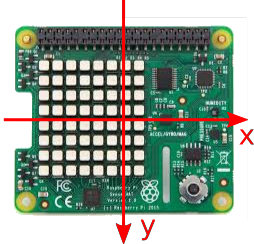
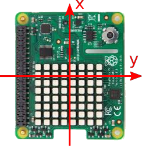
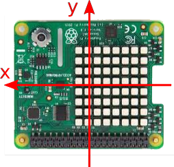
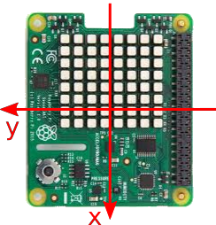

# Puzzle Box - Combination Lock
In this activity you will learn how to create an orientation sensitive combination lock for you **Sense-HAT Puzzle Box**, before working through this activity you should have completed the initial [worksheet](worksheet.md) and have the code shown below.


## The lock Mechanism
Before you begin writing the code to make you combination lock mechanism, it's important to understand how it will behave and how you will create that behaviour with code.

There are many ways you could use the sense hat orientation in a lock mechanism but in this activity you'll make a program that does the following:

- Sets up a sequence of angles that will be the combination.
- Repeatedly (every few seconds) checks the orientation of the Sense-HAT and converts it to an angle.
- Compares this angle with each item in the combination in order.
- If correct it continues to the next item, if not it goes back to the beginning of the sequence.
- Once all items in the combination are complete it unlocks.

The list above roughly describes the program your going to write and is called an **algorithm**, or set of instructions. We can make this algorithm more precise by breaking the steps up into smaller tasks, in computer science we call this **decomposition**.

Here's the same algorithm written in a slightly more detailed way:

> ##### Combination setup.
> > Display an image to show the user that the puzzle box is locked.
> > Create a list of angles (either 0, 90, 180, 270) which forms the combination.
> > Create an empty list to store the correctly completed combination steps. Each time the user gets a step right the step is moved from the combination to another list, when the combination list is empty then the combination is complete.

> ##### Combination Lock loop.
> > Start a loop that continues until the combination has been completely entered.
> > > Check the orientation of the Sense-HAT and convert it to an angle (0,90,180,270)
> > > If the angle matches the next item in the combination then
> > > > Show a green Light
> > > > Move the item from the combination list to the completed list
> > > Otherwise
> > > > Show a red Light
> > > > Move all the items form the completed list back to the combination list


## Converting orientation to angles.
The Sense-HAT measures orientation in 3 axis (x,y,z) but we want to turn that data into a simple rotation angle using the **x** and **y** data. The table below how x,y relate to these rotation angles. When stationary the Sense-HAT will record a measurement of 1*g* (*g* = acceleration due to gravity) straight down, and this can be used to calculate which way up it is.

|  0 degrees | 90 degrees  | 180 degrees | 270 degrees |
| - | - | - | - |
|  |  |  |  |
| **x = 0** | **x = -1** | **x = 0** | **x = 1** |
| **y = 1** | **y = 0** | **y = -1** | **y = 0** |

As your lock program is going to need to regularly calculate its orientation angle you should create a function. The function will need values of **x** and **y** as input and will return the orientation angle as an output. In your **## Functions ##** section add the following code:

```python
##### Functions #####
def get_angle(x,y):
  x = round(x, 0)
  y = round(y, 0)

  if x == -1:
      angle= 180
  elif y == -1:
      angle =  90
  elif y == 1:
      angle = 270
  else:
      angle = 0

  return angle
```

This takes the raw values of x and y and rounds them to the nearest whole number, before using an **if** statement to decide which angle the Sense-HAT is at. Finally it returns the value of angle as its output.

## Setting up you combination lock
Below your **## Locks ##** section you need to add the following code:

```python
##### Locks #####

## Rotation Lock
sense.set_pixels(locked)
code = [0,180,90,0,270]
complete = []
```

The first line of code tells the sense hat to display the locked image and the next two lines create two lists.
- The **code** list contains the elements in the combination lock, in the example 5 numbers have been, but more could be added for a more complex code.
- The second list **complete** will be used to store the completed steps of the combination, each time the user gets a step correct that step gets moved to the complete list.


When the code list is empty then the combination has been completed and the lock is unlocked..

## Creating an unlocking loop

Next you need to create a loop which will continue until the **code** list has been emptied, for this you'll need a **while** loop.

```python


 Before you   start writing the code for this algorithm you will need to add an extra import line to allow your program to make a random choice. Add this to your import section:

`from random import choice`

1. The first thing you'll need to do is ask the sense hat to check and store the current ambient temperature. Under the **Locks** section of you code add a **Temperature Lock** heading and get the current temperature using the line.

  `temp=sense.get_temperature()`

2. Then create a list of numbers called containing a range of numbers that could be added or subtracted from your current temperature. The wider this range of numbers the harder the more challenging the lock is going to be to break.

  `temp_diffs=[
    -1.5,-1.4,-1.3,-1.2,-1.1,-1,-0.9,-0.8,-0.7,-0.6,
    0.6,0.7,0.8,0.9,1,1.1,1.2,1.3,1.4,1.5
    ]`

  There are way to generate a list of number rather than to type them in for for now this is sufficient.

3. Choose a temperature difference at random and add this to your current temperature to get a target temperature.

```Python3
diff = choice(temp_diffs)
target_temp=temp+diff
```

## Waiting for temperature to change.
The next part of your lock program is to repeatedly check the temperature until it reaches, or is close to, the target temperature.

1. Begin a while loop which will only end when the current temperature is close enough to the target temperature. The `abs()` function is used to find the size of the temperature difference by ignoring whether it is positive or negative.

  `while abs(diff) > 0.1:`

  This while loop will end when the current temperature is within 0.1 degrees of the target temperature.

2. Add code within your loop to find the new current temperature and store as **temp**, before using it to recalculate the difference(**diff**) from the target temperature. Your should also
print out the **diff** so that you can test your program.

  ```Python3
while abs(diff) > 0.1:
    temp = sense.get_temperature()

    diff = target_temp - temp
    print(diff)
```

  When you run your program (press F5) you should eventually see some numbers scroll past indicating the current temperature difference. Over time you should be able to increase or decrease the temperature until it gets close enough and unlocks.


## Adding a colour prompt.
You may want to give your user a visual clue as to what they need to do. Include the following code in your lock which will show red when the temperature is too high and blue when to cold.

  ```Python3
    if diff > 0:
      sense.clear(0,0,150)
    else:
      sense.clear(150,0,0)
  ```

## Testing your Lock
To test your lock you could carefully hold you your Raspberry Pi above a hot or cold drink to affect the temperature.

***Embed youtube clip***

## What's Next?
- You may want to add [other locks](worksheet.md) to your Puzzle Box.
- You could adapt this lock by change the temperature range needed to unlock or by having several temperature you have to match in sequence.
