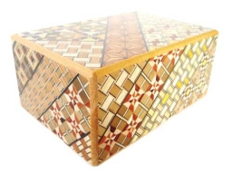

+ HAB Supplies GPS board


#### Python piGPS library

1. There is a custom library created specifically for this resource; to use it you need to download it into the same directory as your project code. To do this, run the following command from a Terminal window in the same directory as your project:

     ```bash
     wget https://goo.gl/fX1lsT -O piGPS.py
     ```

1. In order for the Sense HAT to communicate with the GPS board, you need to disable a service which will conflict with it. To do this, you should enter this command in a Terminal window:

    ```bash
    sudo systemctl disable serial-getty@ttyAMA0.service
    ```

1. You can then test that your GPS board and software are working by running the piGPS Python script:

    ```bash
    python3 piGPS.py
    ```

    The PiGPS program will try to establish a connection with some satellites; once it has connected, it will output the current GPS data to the Terminal.

    `[0,0,0,0,0,0]` - means it's running but hasn't yet found any satellites.
    `[Time,Latitude,Longitude,Altitude,Satellites,GPS Fix]` - the data that will be displayed once satellites have been found.


    ## Early cryptography

    You may think that keeping our information secret and secure is a modern obsession. We have passwords for all our different online accounts and are increasingly concerned with other people having access to our information. However, security of information has been a concern for thousands of years and people have been trying to protect information long before the invention of computers. There are many ways to hide information or keep it secret, all of which can be described as some sort of **[Cryptography](https://simple.wikipedia.org/wiki/Cryptography)**. Two common approaches to using cryptography for securing information are *encryption* and *steganography*; these different approaches can be used separately or together.

    - **[Encryption](https://simple.wikipedia.org/wiki/Encryption)** allows information to be hidden so that it cannot be read without special knowledge such as a password. This is done with a secret code or cypher. The hidden information is said to be **encrypted**.

      > One of the simplest and earliest methods of encryption is known as the Caesar cipher, named after the Roman emperor Julius Caesar, and involves "shifting" each letter a certain amount through the alphabet. So if the shift was 5, then *a* would become *f*, *b* becomes *g* and *c* turns into *h*. To have a go encrypting and decrypting with the Caesar cipher, try this [activity](http://www.geogebra.org/m/1342697).

    - **[Steganography](https://en.wikipedia.org/wiki/Steganography)** involves trying to hide the existence of some secret information; this information could itself be in plain text or encrypted. There are many ways that people have hidden information throughout history. Some early examples:

      > Ancient Greek messengers would have a message tattooed on their shaved head and then travel to their destination once the hair had regrown.  

      > Messages have been written under postage stamps to hide their existence.  

      > Text or objects were hidden inside ornate boxes with secret compartments, or requiring a complex technique to open them. These boxes were popular in Japan where they are known as *Yosegi*; the boxes usually require many steps to open them.  

      

       <iframe width="256" height="192" src="https://www.youtube.com/embed/2A-I5J19GKI" frameborder="0" allowfullscreen></iframe>

    Now it's your turn to make a digital puzzle box like the ones shown above. Using a Raspberry Pi and a Sense HAT add on board, you will "hide" a message behind a series of locks or puzzles that the user will have to solve. You'll be making use of the sensors built into the [Sense HAT](https://projects.raspberrypi.org/en/projects/astro-pi-guide/) for your puzzles.


    ### [Orientation Combination Lock](comb_lock.md)

    It's possible for the Sense HAT to know which way up it is, and point up, down, left, and right. To break this lock, the user must rotate the device to match a sequence of orientations; for example, the combination might be up, left, up, down and the user would have to rotate the Sense HAT in those directions.

    ### [Pressure Lock](pressure_lock.md)

    The Sense HAT can detect the air pressure around it. This could be changed in a number of ways:

     - Placing the Raspberry Pi in a sealed container and squashing it.
     - Cooling or heating the air in the container before sealing it. The air will expand or contract over time, which will change the pressure.
     - Fast-moving air affects the pressure, and you can detect air being blown onto the Sense HAT.

    ### [Location Lock](gps_lock.md)

    Using some additional hardware, your puzzle box is able to calculate where in the world it is. A really challenging lock would be one that requires the user to go to a specific place.
