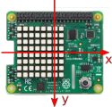
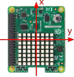
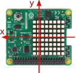
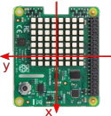

## Convert orientation to an angle

The Sense HAT measures orientation in three axes (x, y, z), but we want to turn that data into a simple rotation angle using the `x` and `y` data. When stationary, the Sense HAT will record a measurement of 1**g** (**g** = acceleration due to gravity) straight down, and this can be used to calculate which way up it is.

The table below shows how the **g** measurements of x and y relate to these rotation angles.

|  0 degrees | 90 degrees  | 180 degrees | 270 degrees |
| - | - | - | - |
|  |  |  |  |
| **x = 0** | **x = -1** | **x = 0** | **x = 1** |
| **y = 1** | **y = 0** | **y = -1** | **y = 0** |


As your lock program is going to need to regularly calculate its orientation angle from the **g** measurement, you should create a function to perform this calculation.

[[[generic-python-simple-functions]]]

This function will need values of `x` and `y` as inputs, and will return the orientation angle as an output.

+ In the **functions** section, define a function called `get_angle(x,y)`

+ Inside the function, round the values of `x` and `y` to zero decimal places using the `round` function.

[[[rounding-numbers-with-python]]]

+ Create an `if` statement to return the correct angle from the table above. For example, you might start off like this to represent the first angle (0&deg;) in the table:

```python
if x == 0 and y == 1:
    return 0
```

[[[generic-python-conditional-selection-with-boolean]]]

--- hints ---
--- hint ---
Continue to add more conditions to your statement using `elif` to check for the other three angles in the table.
--- /hint ---
--- hint ---
Here is how your finished code should look:

```python
##### Functions #####
def get_angle(x,y):
  x = round(x, 0)       
  y = round(y, 0)

  if x == 0 and y == 1:
      return 0
  elif x == -1 and y == 0:
      return 90
  elif x == 0 and y == -1:
      return 180
  elif x == 1 and y == 0:
      return 270
```
--- /hint ---
--- /hints ---
