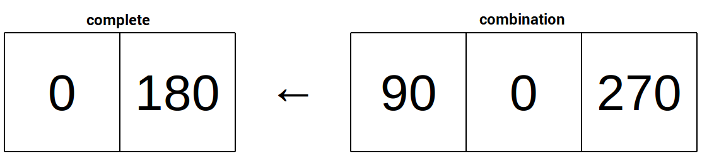

## Set the combination

Now you need to specify the sequence of angles 


 your `Locks` section, you need to add the following code:

```python
##### Locks #####

## Rotation Lock
sense.set_pixels(locked)
code = [0,180,90,0,270]
complete = []
```

The first line of code tells the Sense HAT to display the "locked" image and the next two lines create two lists:

- The `code` list contains the elements in the combination lock. In the example five numbers have been used, but more could be added for a more complex code.
- The second list, `complete`, will be used to store the completed steps of the combination: each time the user gets a step correct, that number gets moved to the complete list.



When the code list is empty then the combination has been completed and the lock is unlocked.

## Creating an unlocking loop

Next, you need to create a loop which will continue until the `code` list has been emptied. For this you'll need a `while` loop.

1. Start your loop with the following code:

```python
while len(code)>0:
  acc = sense.get_accelerometer_raw()
  x = acc["x"]
  y = acc["y"]
```

The condition `len(code)>0` checks whether the length of the combination code is greater than 0. If it is, then the loop continues; if not, it exits.
The following three lines get the acceleration data from the sensor and store x and y data in two variables.

1. Next, you'll need to convert `x` and `y` to an angle using your `get_angle` function and compare that with the first item in the `code` list.

```python
if get_angle(x,y) == code[0]:
   complete.append(code.pop(0))
   sense.set_pixel(0,0,g)
```

- The condition `get_angle(x,y) == code[0]` uses the `get_angle` function to convert `x` and `y` to an angle. It then checks whether the angle matches the first item in `code`.
- If the angle matches then the line `complete.append(code.pop(0))` removes (or "pops") the first item from `code` and adds it to the `complete` list.
- The `sense.set_pixel(0,0,g)` line turns a single LED green to inform the user they got that step right.

1. If the user gets the angle wrong then the `complete` and `code` lists reset and a red LED is shown. Add the following `else` condition to your `if` block:

```python
if get_angle(x,y) == code[0]:
   complete.append(code.pop(0))
   sense.set_pixel(0,0,g)
else:
   code = complete + code
   complete = []
   sense.set_pixel(0,0,r)
```

1. Finally, you'll need to add some `sleep` commands to give the user time to rotate their Sense HAT. Using two sleep commands and turning the LED off in between will create a flashing LED that informs the user whether they've got the steps correct.

```python
sleep(1)
sense.set_pixel(0,0,e)
sleep(1)
```


## Testing your lock
