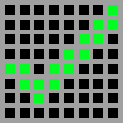
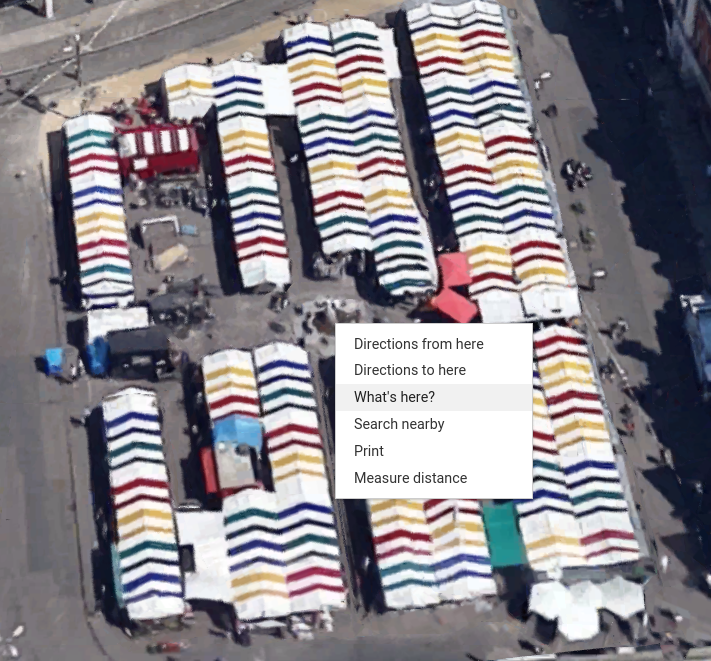
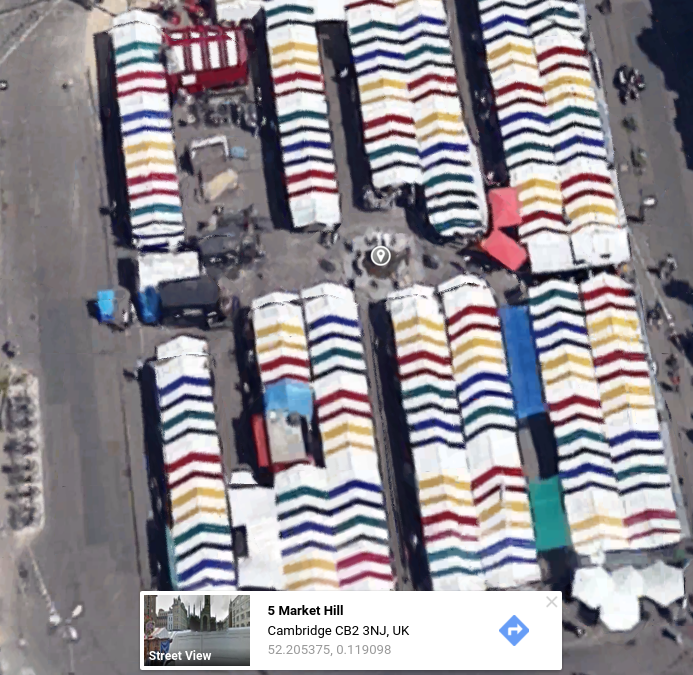

## Set the target

If you have followed the instructions, you should have a copy of the **piGPS** library installed and tested.

+ In the **import** section and add this code to import the necessary functionality:

```python3
from piGPS import GPS
```

+ Add a pixel art image to your program to indicate when a target location has been reached. We chose a green tick, but you can draw whatever you like.

  

To add the tick to your code, create a new pixel art image in the **Pixel Art** section:

```python3
tick = [
e,e,e,e,e,e,e,g,
e,e,e,e,e,e,g,g,
e,e,e,e,e,g,g,e,
e,e,e,e,g,g,e,e,
g,g,e,g,g,e,e,e,
e,g,g,g,e,e,e,e,
e,e,g,e,e,e,e,e,
e,e,e,e,e,e,e,e
    ]
```

The program you're going to write needs at least one location target but can have many.

+ In the "locks" section, create a GPS object called *gps* which will monitor the GPS board and convert its raw data into Longitude, Latitude and Altitude, as well as other helpful data.

```python3
gps = GPS()
```

+ Choose your destination and find out its latitude and longitude using an online mapping service such as [Google Maps](http://maps.google.com)

+ Find your chosen location on the map and right-click on it



+ Select **What's here** and the latitude and longitude will be shown below.



+  Choose as many locations as you like and add them to a two dimensional list in your Python script:

```python3
targets = [
  [52.205375, 0.119098],
  [52.202201, 0.128203]
]
```

Make sure you pick nearby locations, otherwise you'll find testing very difficult!
