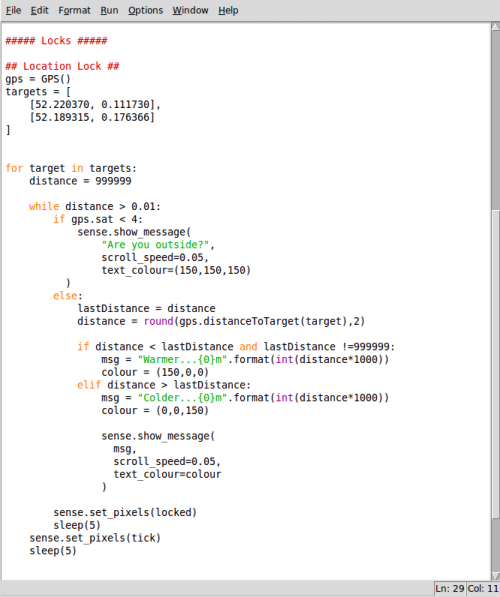

## Get your user outside

Your user is unlikely to receive GPS signals unless they're outside, so you need to check whether they have a signal and if not prompt them to talk a walk. Before you do that there are a couple of other steps to take.

  1. Start a loop which will pick each *target* from the *targets* list; you then set a variable called *distance* with the initial (ridiculous) value of 999999 km. This value means that the program assumes the next location is far away, until it can work out an accurate distance.

  The value 999999 km has been used because it can't be mistaken for a genuine measurement; 999999 km is about 25x the distance around the Earth.

  ```python3
for target in targets:
    distance = 999999
```

  1. Next, you need to start a `while` loop which will continue until your current position is less than 10m (0.01km) from the target position. Within that loop you'll need to check whether your GPS object is communicating with 4 or more satellites; if not, the user is told to go outside.

  ```python3
  for target in targets:
      distance = 999999

      while distance > 0.01:
          if gps.sat < 4:
              sense.show_message(
                "Are you outside?",
                scroll_speed=0.05,
                text_colour=(150,150,150)
              )

  ```

  1. Test this out; if you run your program you should be prompted to go outside. At this point you can either go outside or hang your GPS antenna out a window and it should start to get a GPS signal.

## Checking current distance and feedback

Once your program begins receiving GPS data, it won't currently do anything with it. You'll need to first calculate the distance to the current target and check whether the user is getting closer or farther away.

The piGPS library you imported earlier has a built-in function to calculate the distance to the current target. Before finding the current distance you need to store the previous distance in a new variable *lastDistance*. Continue your `while` loop, adding these three lines:

    ```python3
    for target in targets:
        distance = 999999

        while distance > 0.01:
            if gps.sat < 4:
              sense.show_message(
                "Are you outside?",
                scroll_speed=0.05,
                text_colour=(150,150,150)
              )
            else:
                lastDistance = distance
                distance = round(gps.distanceToTarget(target),2)
    ```

  1. Next, you need to add a couple of other conditions that check whether the user has got closer or farther away. In the first `if` statement you need to check whether *lastDistance* = 999999. If it was then it should be ignored, so that the user isn't told they have got closer just because a GPS lock has been achieved.

    ```python3
    for target in targets:
        distance = 999999

        while distance > 0.01:
            if gps.sat < 4:
                sense.show_message(
                  "Are you outside?",
                  scroll_speed=0.05,
                  text_colour=(150,150,150)
                )
            else:
                lastDistance = distance
                distance = round(gps.distanceToTarget(target),2)

                if distance < lastDistance and lastDistance !=999999:
                    msg = "Warmer...{0}m".format(int(distance*1000))
                    colour = (150,0,0)
                elif distance > lastDistance:
                    msg = "Colder...{0}m".format(int(distance*1000))
                    colour = (0,0,150)

                    sense.show_message(
                      msg,
                      scroll_speed=0.05,
                      text_colour=colour
                    )


    ```

  1. The last bit of feedback to do is to display the locked symbol for 5 seconds, using the two lines shown below:

    ```python3
    for target in targets:
        distance = 999999

        while distance > 0.01:
            if gps.sat < 4:
                sense.show_message(
                  "Are you outside?",
                  scroll_speed=0.05,
                  text_colour=(150,150,150)
                )
            else:
                lastDistance = distance
                distance = round(gps.distanceToTarget(target),2)

                if distance < lastDistance and lastDistance !=999999:
                    msg = "Warmer...{0}m".format(int(distance*1000))
                    colour = (150,0,0)
                elif distance > lastDistance:
                    msg = "Colder...{0}m".format(int(distance*1000))
                    colour = (0,0,150)

                    sense.show_message(
                      msg,
                      scroll_speed=0.05,
                      text_colour=colour
                    )

            sense.set_pixels(locked)
            sleep(5)
        ```

## Reaching your destination

Each time the user reaches a step in their journey your program should notify them. This is where your pixel art comes in. Add two lines outside your loop to first show the pixel art and then pause before continuing:

  ```python3
  for target in targets:
      distance = 999999

      while distance > 0.01:
          if gps.sat < 4:
              sense.show_message(
                "Are you outside?",
                scroll_speed=0.05,
                text_colour=(150,150,150)
              )
          else:
              lastDistance = distance
              distance = round(gps.distanceToTarget(target),2)

              if distance < lastDistance and lastDistance !=999999:
                  msg = "Warmer...{0}m".format(int(distance*1000))
                  colour = (150,0,0)
              elif distance > lastDistance:
                  msg = "Colder...{0}m".format(int(distance*1000))
                  colour = (0,0,150)

                  sense.show_message(
                    msg,
                    scroll_speed=0.05,
                    text_colour=colour
                  )

          sense.set_pixels(locked)
          sleep(5)
      sense.set_pixels(tick)
      sleep(5)

      ```

Once this loop completes all the targets, the program will continue either to the next lock or to the hidden message.

Your complete lock [code](code/puzzle_box_location.py) should look like this; be sure to check the capital letters and indentations carefully.



## Testing your lock

This lock is tricky to test as you need to go outside. Connect your Raspberry Pi to a battery pack and take a wander. Here's a demonstration:

<iframe width="420" height="315" src="https://www.youtube.com/embed/mGSCdPl_iDs" frameborder="0" allowfullscreen></iframe>

## What's Next?

- You may want to add [other locks](worksheet.md) to your puzzle box.
- You could adapt this lock by changing how close the user needs to get; the `while distance > 0.01:` controls this. (0.01 = 10m)
- You could use the magnetometer functionality of the Sense HAT to create a compass which points the way to each target.
