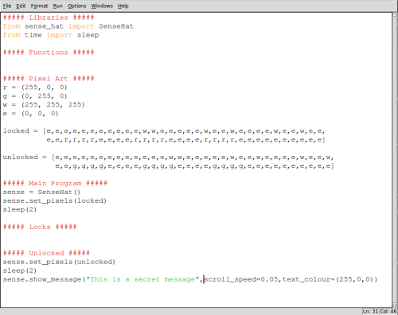

## Adding some pixel art

It would be helpful to show the user some feedback as to whether the box is locked or not. For this example you're going to use a pair of padlock images: one red padlock (locked) and one green (unlocked).


In order to create these images, you're first going to choose some colours to use; the Sense HAT uses **R**ed, **G**reen and **B**lue values to describe colour. The amount of red, green and blue is described by 3 numbers between 0 and 255. In the example image there are 3 colours used:

  - **Red** = (255,0,0) # Maximum amount of red, with no green or blue
  - **Green** = (0,255,0 # No red, full green, no blue
  - **White** = (255,255,255) # Maximum of all three colours
  - **Empty / Black** = (0,0,0) # All colours off

- In your code you should add these lines in the **Pixel Art** section, which will store your colour choices in some variables and then create two lists to represent the two images. If you look carefully you can make out the shape of the padlocks.

  ```python3
  ##### Pixel Art #####
  r = (255, 0, 0)
  g = (0, 255, 0)
  w = (255, 255, 255)
  e = (0, 0, 0)

  locked = [
    e,e,e,e,e,e,e,e,
    e,e,e,w,w,e,e,e,
    e,e,w,e,e,w,e,e,
    e,e,w,e,e,w,e,e,
    e,e,r,r,r,r,e,e,
    e,e,r,r,r,r,e,e,
    e,e,r,r,r,r,e,e,
    e,e,e,e,e,e,e,e
    ]

  unlocked = [
    e,e,e,e,e,e,e,e,
    e,e,e,e,e,w,w,e,
    e,e,e,e,w,e,e,w,
    e,e,e,e,w,e,e,w,
    e,e,g,g,g,g,e,e,
    e,e,g,g,g,g,e,e,
    e,e,g,g,g,g,e,e,
    e,e,e,e,e,e,e,e
    ]
  ```

- Next, in your **Main Program** section you should add these lines which will show the locked image for 2 seconds:
  
  ```python3
  sense.set_pixels(locked)
  sleep(2)
  ```

- After your **Unlocked** section you should do the same thing, but this time with your unlocked image:

  ```python3
  sense.set_pixels(unlocked)
  sleep(2)
  ```

- Your program should now look like this:

  

