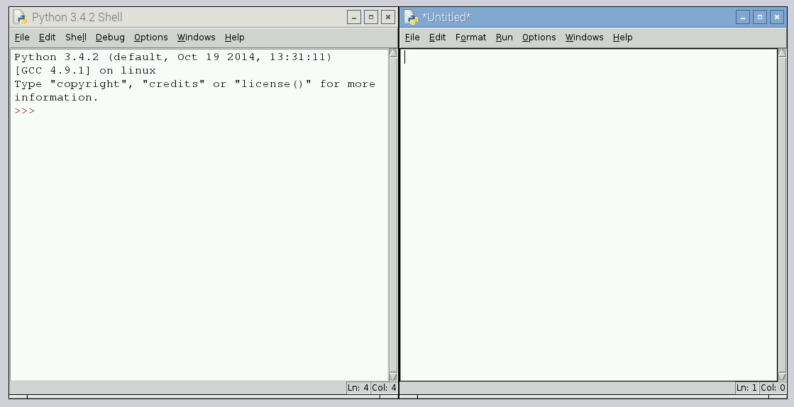

## Getting started

- Before you can make your puzzle box program, you'll need to assemble your Sense HAT and install the appropriate software for it. To do this, follow these instructions:

  - [Assemble your Sense HAT & Raspberry Pi](https://projects.raspberrypi.org/en/projects/astro-pi-guide/assemble.md)
  - [Check you've installed the required software](software.md)

- Once assembled, you should power up your Raspberry Pi and launch **Python 3 (IDLE)** from the **Programming** section of the menu.

  

- Once Python 3 has loaded, you should create a new program by clicking **File** then **New**.

  

  The window on the right is where you will write your code and the left-hand window is where it will run. In the right-hand window you should enter the following code:

    ```python3
    ##### Libraries #####
    from sense_hat import SenseHat
    from time import sleep
  
    ##### Functions #####
  
    ##### Pixel Art #####
  
    ##### Main Program #####
    sense = SenseHat()
  
  
    ##### Locks #####
  
    ##### Unlocked #####
    sense.show_message("This is a secret message",scroll_speed=0.05,text_colour=(255,0,0))
    ```
    
  This short piece of starter code carries out a few simple tasks:
  
    - `from sense_hat import SenseHat` adds the ability to control the Sense Hat from your program.
    - `from time import sleep` imports the `time` library so that your program can pause for periods of time.
    - `sense = SenseHat()` creates an object that refers to *your* connected Sense Hat; you will use the word *sense* to tell you Sense Hat what to do.
    - `sense.show_message...` shows the text on the Sense Hat display at a speed of 0.05 and in red (255,0,0). To choose a different colour you can use a number of [websites](http://www.rapidtables.com/web/color/RGB_Color.htm) that will give the **RGB** values for any colour you like.
    - The lines starting with *#* symbols are *comments* and are only there as headings; they are ignored by Python.

  Below the **Locks** heading you'll be adding some code which will prevent the program getting to the last line, unless the user has performed a certain action. Before you get started on making these locks, you're going to create some pixel art to show the state of the puzzle box.

