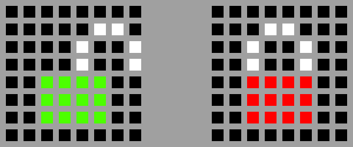

## Locked or not?

It would be helpful to show the user some feedback as to whether the box is locked or not. For this example you're going to use a pair of padlock images: one red padlock (locked) and one green (unlocked).

+ In the **Pixel art** section, create four variables called `r`, `g`, `w` and `b`. These should represent the colours red, green, white and black/blank, in RGB format. For example, your `r` variable should look like this:

```python
r = (255, 0, 0)
```

[[[generic-theory-colours]]]

+ Create two different lists of 64 items, one to represent the locked padlock and the other to represent the opened padlock.



[[[rpi-sensehat-multiple-pixels]]]

--- hints ---

--- hint ---
Create two lists, each containing 64 items. Each item in the list should be the name of one of the colour variables you just created. For example, to place a blank pixel in the top left corner of the LED matrix, the first item in the list should be `b`.
--- /hint ---

--- hint ---
Here is how your code should look:

```python

locked = [
e,e,e,e,e,e,e,e,
e,e,e,w,w,e,e,e,
e,e,w,e,e,w,e,e,
e,e,w,e,e,w,e,e,
e,e,r,r,r,r,e,e,
e,e,r,r,r,r,e,e,
e,e,r,r,r,r,e,e,
e,e,e,e,e,e,e,e
]

unlocked = [
e,e,e,e,e,e,e,e,
e,e,e,e,e,w,w,e,
e,e,e,e,w,e,e,w,
e,e,e,e,w,e,e,w,
e,e,g,g,g,g,e,e,
e,e,g,g,g,g,e,e,
e,e,g,g,g,g,e,e,
e,e,e,e,e,e,e,e
]
```
--- /hint ---
--- /hints ---

+ In the **main program** section, add some code just before the secret message. The new could should display the locked image on the LED matrix, then wait 2 seconds, then display the unlocked image and wait for another 2 seconds.

[[[generic-python-sleep]]]

--- hints ---
--- hint ---
Use the `set_pixels` method to display a list of pixels on the LED matrix.

--- /hint ---

--- hint ---
Use the `sleep` method to ask the program to wait. You can change the number in the brackets to change how long the program waits, for example `sleep(1)` will wait for 1 second.
--- /hint ---

--- hint ---
Here is how the code should look:

```python
sense.set_pixels(locked)
sleep(2)
sense.set_pixels(unlocked)
sleep(2)
```
--- /hint ---
--- /hints ---

Now that your basic code is ready, it's time to add some locks to protect your secret message. These locks can be added in any order and it's up to you to choose which you will add.
