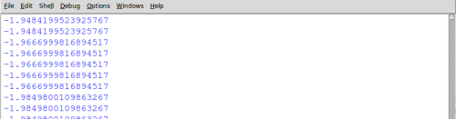
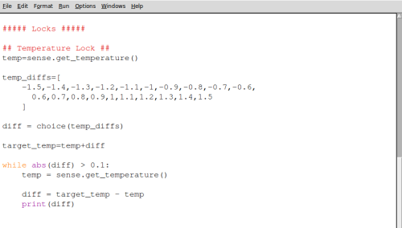

## Temperature lock

Using the Sense HAT's temperature sensors, this lock will require the user to raise or lower the temperature by a number of degrees in order to unlock.

### How will the lock work?

The lock will work as follows:

- Choose a target temperature close to the current temperature
- Display a clue as to whether the Sense HAT is too cold or too hot compared to the target temperature
- Continually check the current temperature against the target temperature
- When the target temperature is reached, display the unlocked graphic

The list above roughly describes the program you're going to write and is called an **algorithm** or a set of instructions.


+ In the **locks** section, create a variable called `current_temp` and assign it the value of a reading from the Sense HAT to find the current temperature.

[[[rpi-sensehat-temperature]]]

+ Next, create a list of numbers called `temp_diffs`, containing a range of numbers that could be added or subtracted from your current temperature. The wider this range of numbers, the harder the lock is going to be to break.

```python
temp_diffs=[
  -1.5,-1.4,-1.3,-1.2,-1.1,-1,-0.9,-0.8,-0.7,-0.6,
  0.6,0.7,0.8,0.9,1,1.1,1.2,1.3,1.4,1.5
]
```

+ Create another new variable called `diff`. Choose a temperature difference at random from the list and assign this as the variable's value.

[[[generic-python-random-choice]]]

+ Create a new variable called `target_temp` which is equal to the `current_temp` plus the randomly chosen difference. Print out the value of this variable so you can see whether your code worked.


--- hints ---

--- hint ---
Use the `get_temperature` method to obtain the current temperature. This is called the **ambient temperature**.
--- /hint ---

--- hint ---
Don't forget to add the import statement to your **libraries** section to allow you to use the random choice function:

```python
from random import choice
```
--- /hint ---

--- hint ---
Here is how your code should look:

```python
current_temp = sense.get_temperature()
temp_diffs=[
  -1.5,-1.4,-1.3,-1.2,-1.1,-1,-0.9,-0.8,-0.7,-0.6,
  0.6,0.7,0.8,0.9,1,1.1,1.2,1.3,1.4,1.5
]
diff = choice(temp_diffs)
target_temp = current_temp + diff
```

--- /hint ---
--- /hints ---

## Waiting for the temperature to change

The next part of your lock program is to repeatedly check the temperature until it reaches, or is close to, the target temperature.

1. Begin a `while` loop which will only end when the current temperature is close enough to the target temperature. The `abs()` function is used to find the size of the temperature difference, by ignoring whether it's positive or negative.

  `while abs(diff) > 0.1:`

  This `while` loop will end when the current temperature is within 0.1 degrees of the target temperature.

1. Add code within your loop to find the new current temperature and store it as **temp**, before using it to recalculate the difference(**diff**) from the target temperature. Your should also print out the **diff** so that you can test your program.

  ```Python3
  while abs(diff) > 0.1:
      temp = sense.get_temperature()

      diff = target_temp - temp
      print(diff)
  ```

  When you run your program by pressing F5, you should eventually see some numbers scroll past indicating the current temperature difference. Over time, you should be able to increase or decrease the temperature until it gets close enough and unlocks.



## Adding a colour prompt

You may want to give your user a visual clue as to what they need to do. Include the following code in your lock, which will show red when the temperature is too high and blue when too cold.

  ```Python3
    if diff > 0:
      sense.clear(0,0,150)
    else:
      sense.clear(150,0,0)
  ```

Your final lock code should look like the image below and can be downloaded [here](code/puzzle_box_temp.py).



## Testing your lock

To test your lock, you could carefully hold your Raspberry Pi above a hot or cold drink to affect the temperature.

<iframe width="560" height="315" src="https://www.youtube.com/embed/zIgaA9zaaA4" frameborder="0" allowfullscreen></iframe>

## What's next?

- You may want to add [other locks](worksheet.md) to your puzzle box.
- You could adapt this lock by changing the temperature range needed to unlock it, or by having several temperatures you have to match in sequence.
