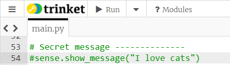
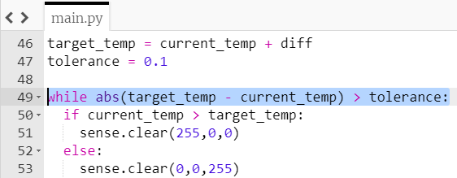

## Temperature lock

Using the Sense HAT's temperature sensors, this lock will require the user to raise or lower the temperature by a number of degrees in order to unlock.

### How will the lock work?

The lock will work as follows:

- Choose a target temperature close to the current temperature
- Display a colour clue as to whether the Sense HAT is too cold or too hot compared to the target temperature
- Continually check the current temperature against the target temperature
- When the target temperature is reached, display the unlocked graphic

The list above roughly describes the program you're going to write and is called an **algorithm** or a set of instructions.

### Choose a target temperature

+ In the **locks** section, create a variable called `current_temp` and assign it the value of a reading from the Sense HAT to find the current temperature.

Take a look at this information to find out how to take a temperature reading, and add the one line of code you need to your program.

[[[rpi-sensehat-temperature]]]

+ Next, create a list of numbers called `temp_diffs`, containing a range of numbers that could be added or subtracted from your current temperature. The wider this range of numbers, the harder the lock is going to be to break.

```python
temp_diffs=[
  -1.5,-1.4,-1.3,-1.2,-1.1,-1,-0.9,-0.8,-0.7,-0.6,
  0.6,0.7,0.8,0.9,1,1.1,1.2,1.3,1.4,1.5
]
```

+ Create another new variable called `diff`. Choose a temperature difference at random from the list and assign this as the variable's value.

[[[generic-python-random-choice]]]

+ Create a new variable called `target_temp` which is equal to the `current_temp` plus the randomly chosen difference. Print out the value of this variable so you can see whether your code worked. You can remove the `print` once you have checked your code works.

--- hints ---

--- hint ---
Use the `get_temperature` method to obtain the current temperature. This is called the **ambient temperature**.
--- /hint ---

--- hint ---
Don't forget to add the import statement to your **libraries** section to allow you to use the random choice function:

```python
from random import choice
```
--- /hint ---

--- hint ---
Here is how your code should look:

```python
current_temp = sense.get_temperature()
temp_diffs=[
  -1.5,-1.4,-1.3,-1.2,-1.1,-1,-0.9,-0.8,-0.7,-0.6,
  0.6,0.7,0.8,0.9,1,1.1,1.2,1.3,1.4,1.5
]
diff = choice(temp_diffs)
target_temp = current_temp + diff
print(target_temp)
```

--- /hint ---
--- /hints ---

### Display a colour clue

You need to give your user a visual clue as to what they need to do to unlock the temperature lock. For example, you could display blue on the Sense HAT's LED matrix if the current temperature is too cold, or red if it is currently too hot.

+ Find out the code you will need to display a colour on the Sense HAT's LED matrix from the information below:

[[[rpi-sensehat-display-colour]]]

+ Write an `if` statement to check whether the `current_temp` is greater than the `target_temp`. If it is, display red on the LED matrix, and if not display blue.

[[[generic-python-conditional-selection-with-boolean]]]

--- hints ---
--- hint ---
Use the `clear()` method to display a colour on the LED matrix, and put the RGB values of the colour you would like in the brackets. For example, to fill the screen with green you would write

```python
sense.clear(0, 255, 0)
```
--- /hint ---
--- hint ---
You will need to use an `if`/`else` statement to decide whether the current temperature is greater than (`>`) the target temperature. The `else` part should contain the code you want to run if the current temperature is not greater than the target temperature.
--- /hint ---

--- hint ---
Here is how your code should look:

```python
if current_temp > target_temp:
  sense.clear(255,0,0)
else:
  sense.clear(0,0,255)
```
--- /hint ---
--- /hints ---

+ If you run your code, you will only see a brief flash of the colour before your secret message is revealed. Add a `#` before your secret message to comment it out so that you can more easily see which colour is displayed.



You can remove the `#` once you know your lock is working properly.

### Continually check the temperature

At the moment your lock will only check the temperature once. The next part of your lock program needs to repeatedly check the temperature until it reaches, or is close to, the target temperature.

You can use the `abs()` function to find out how big the difference between the current temperature and the target temperature is, ignoring whether the difference is positive or negative.

```python
abs(target_temp - current_temp)
```

+ Create a variable called `tolerance` - this is how close the current temperature will have to be to the target temperature for the lock to be unlocked. You can set the tolerance as `0.1` to begin with, and adjust it if you want to make the lock easier or harder to unlock.

**Note:** If you are using the Sense HAT emulator you will need to set the tolerance to `1` because it is not possible to simulate temperature changes with sufficient precision. However, this means that you will also have to change your range of `temp_diffs` because if a diff is chosen that is less than 1, your box will instantly unlock!

+ Create a `while` loop that runs while the difference between the current temperature and the target temperature is larger than the tolerance. Put the code you wrote to display the colours in the while loop by **indenting** it.

[[[generic-python-while-counter]]]

--- hints ---
--- hint ---
Use the `abs()` function to find the size of the difference between the temperatures, and then compare that difference to 0.1
--- /hint ---

--- hint ---
Here is how your code should look:


--- /hint ---

--- /hints ---

You might expect the colour to change if you move the temperature slider, but if you try this while the program is running, it won't work. Why?

--- collapse ---
---
title: Answer
---
Once the program enters the `while` loop, the current temperature is never updated. It remains exactly the same, so there is no chance of the colour ever updating and no chance that the loop will ever end.
--- /collapse ---

+ Fix this problem by adding a line of code to take the current temperature **inside** the loop. Don't delete or move the original line of code which takes the temperature though as you still need that to take the ambient temperature at the start.

### Display the unlock picture
You already have the code which displays the locked image followed by the unlocked image. Ensure that this code is situated after your while loop and not indented.

+ To test your lock, you could carefully hold your Raspberry Pi near a heater or an open window to affect the temperature.
