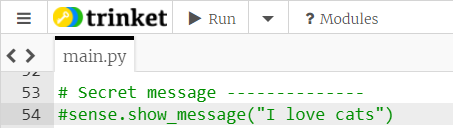

## Display a clue

You need to give your user a visual clue about what they need to do to unlock the temperature lock. For example, you could display blue on the Sense HAT's LED matrix if the current temperature is too cold, or red if it is too hot.

+ Find out the code you will need to display a colour on the Sense HAT's LED matrix in this section:

[[[rpi-sensehat-display-colour]]]

+ Write an `if` statement to check whether the `current_temp` is greater than the `target_temp`. If it is, display red on the LED matrix, and if not, display blue.

[[[generic-python-conditional-selection-with-boolean]]]

--- hints ---
--- hint ---
Use the `clear()` method to display a colour on the LED matrix, and put the RGB values of the colour you would like in the brackets. For example, to fill the screen with green, you would write:

```python
sense.clear(0, 255, 0)
```
--- /hint ---
--- hint ---
You will need to use an `if/else` statement to decide whether the current temperature is greater than (`>`) the target temperature. The `else` part should contain the code you want to run if the current temperature is not greater than the target temperature.
--- /hint ---

--- hint ---
Here is how your code should look:

```python
if current_temp > target_temp:
  sense.clear(255,0,0)
else:
  sense.clear(0,0,255)
```
--- /hint ---
--- /hints ---

+ If you run your code, you will only see a brief flash of the colour before your secret message is revealed. Add a `#` at the beginning of the line of code displaying your secret message to comment it out. Then you can more easily see which colour is displayed.



You can remove the `#` once you know your code is working properly.
