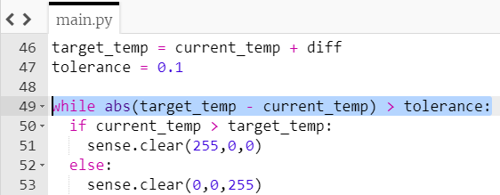

## Check for unlocking

At the moment your lock will only check the temperature once. The next part of your lock program needs to repeatedly check the temperature until it reaches, or is close to, the target temperature.

You can use the `abs()` function to find out how big the difference between the current temperature and the target temperature is, ignoring whether the difference is positive or negative.

```python
abs(target_temp - current_temp)
```

+ Create a variable called `tolerance` — this is how close the current temperature will have to be to the target temperature for the lock to be unlocked. You can set the tolerance as `0.1` to begin with, and adjust it if you want to make the lock easier or harder to unlock.

+ Create a `while` loop that runs while the difference between the current temperature and the target temperature is larger than the `tolerance`. Put the code you wrote to display the colour clues in the while loop by **indenting** it.

[[[generic-python-while-counter]]]

--- hints ---
--- hint ---
Use the `abs()` function to find the size of the difference between the temperatures, and then compare that difference to the `tolerance` variable.
--- /hint ---

--- hint ---
Here is how your code should look:


--- /hint ---

--- /hints ---

You might expect the colour to change when you warm up or cool down the Sense HAT, but if you try this while the program is running, it won't work. Why?

--- collapse ---
---
title: Answer
---
Once the program enters the `while` loop, the `current_temp` variable is never updated. It remains exactly the same, so the colour will never change and the loop will never end.
--- /collapse ---

+ Fix this problem by adding a line of code to take the current temperature **inside** the loop. However, don't delete or move the original line of code which takes the temperature — you still need it to take the ambient temperature at the start.

### Display the `unlocked` picture
You already have the code which displays the `locked` image followed by the `unlocked` image. Ensure that this code is situated below your while loop and not indented.

+ To test your lock, you could affect the temperature for example by carefully holding your Sense HAT near a heater or an open window.
