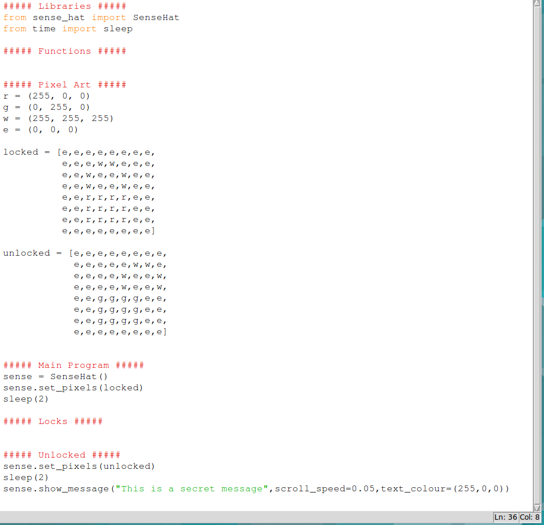

# Puzzle Box - Temperature Lock
In this activity you will learn how to create temperature sensitive lock for you **Sense-HAT Puzzle Box**, before working through this activity you should have completed the initial [worksheet](worksheet.md) and have the code shown below.

## The lock Mechanism
Before you begin writing the code to make you temperature lock mechanism, it's important to understand how it will behave and how you will create that behaviour with code.

There are many ways you could use temperature in a lock mechanism but in this activity you'll make a program which behaves like this:
- Finds out the current temperature.
- It then chooses a target temperature close to the current temperature.
- The device then gives you some kind of clue as to whether it's too cold or too hot compared to the target temperature.
- It then continually watches the current temperature until it's close enough to the target temperature.
- Finally the program will give indication that the temperature lock is unlocked.

The list above roughly describes the program your going to write and is called an **algorithm**, or set of instructions. We can make this algorithm more precise by breaking the steps up into smaller tasks, in computer science we call this **decomposition**.

Here's the same algorithm written in a slightly more detailed way:

> *Finds out the current temperature.*  
> > Measure the temperature using the Sense-HAT and store the result as **current_temp**  
> *Choose a target temperature close to the current temperature.*  
> > Setup a list of numbers that can be added or subtracted from the **current_temp**, call this list **temp_diffs**  
> > Randomly pick a value from **temp_diffs** and call this number **diff**  
> > Add the selected **diff** to the **current_temp** to get the **target_temp**  
> *Show whether it's too cold or too hot compared to the target temperature*  
> > If the **diff** is positive then the leds should be all blue (device is colder than **target_temp**)  
> > Otherwise the LEDs should be all red (currently hotter than **target_temp**)  
> *continually watches the current temperature until it's close enough to the target temperature*  
> > While the **diff** is greater than 0.1  
> > Measure the current temperature using the Sense-HAT  
> > Recalculate the **diff** by subtracting the **current_temp** from the **target_temp**  
> *indicate that the temperature lock is unlocked*  
> > Light all the LEDs green  
> > Wait for 2 seconds  
> > Switch all the LEDs off.  
