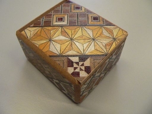

# Sense-HAT Puzzle Box
You may think that keeping our information secret and secure is a modern obsession, we all have password for all our different online accounts and are increasing concerned with other people having access to our information. However security of information has been a concern for thousands of years and people have been trying to protect information long before the advent of computers. There are many ways to hide or secure information all of which can be descibed as some sort of **[Cryptography](https://simple.wikipedia.org/wiki/Cryptography)**

Two common Crytographic approaches for securing information are *Encryption* and *Stenograph*, these approaches differ but can often be used together.
  > **[Encryption](https://simple.wikipedia.org/wiki/Encryption)** allows information to be hidden so that it cannot be read without special knowledge (such as a password). This is done with a secret code or cypher. The hidden information is said to be encrypted."

  One of the simplest and earliest methods of encrytion is known as the Caesar cipher (Named after the Roman Emporer Julius Caesar) and involves "shifting" each letter a certain amount through the alphabet. So if the shift was 5 then *a* would be encoded as *f*, *b* as *g* and *c* as *h*. To have a go encrypting and decrypting with the Caesar cipher try this [activity](http://www.geogebra.org/m/1342697).

  > **[Steganography](https://en.wikipedia.org/wiki/Steganography)** involves trying to hide the existence of some secret information, the information could itself be in plain text or encrypted. There are many ingenious ways that people have hidden information throughout history.

  Some early examples include:
  - Ancient Greek messengers would have a message tattood on their shaved head and then sent to their destination once the hair had regrown.
  - Messages written under postage stamps to hide their existence.
  - Text or objects hidden inside ornate boxes which have secret compartments or a complex technique to open them. These boxes were popular in Japan where they are known as *Yosegi*, the boxes vary in complexity but usually require many steps to open them.

  |  | ](https://youtu.be/2A-I5J19GKI) |
  |------------------------------|-------------|

## 
Throw / drop / shake

## Joystick Lock
combination of key presses to unlock

## rotation lock
Turn to set positions in sequence

## Temperature Lock
Keep at / below / above a certain temperature

## Humidity
rasie humidity by 5% and maintain for 10 seconds

## Add GPS board for GPS lock

How to hide plain text "secret" in python code

<iframe scrolling="no" src="https://tube.geogebra.org/material/iframe/id/1342697/width/1022/height/683/border/888888/rc/false/ai/false/sdz/false/smb/false/stb/false/stbh/true/ld/false/sri/true/at/auto" width="1022px" height="683px" style="border:0px;"> </iframe>
